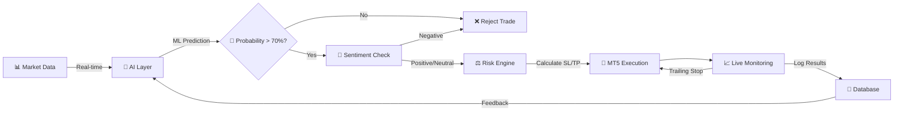

# 🎯 SNIPR-X: AI-Powered Trading Bot

<div align="center">


### *Protecting Capital First, Capturing Profits Second*

[](https://www.python.org/)
[](https://www.metatrader5.com/)
[](https://fastapi.tiangolo.com/)
[](https://nextjs.org/)
[](LICENSE)

[📖 Documentation](#-documentation) •
[🚀 Quick Start](#-quick-start) •
[💡 Features](#-key-features) •
[🛠️ Tech Stack](#️-tech-stack) •
[📊 Architecture](#-system-architecture)

</div>

---

## 📈 Performance at a Glance

<div align="center">

| Metric | Value | Description |
|--------|-------|-------------|
| **🧠 AI Layers** | `3` | ML Filter + LLM Sentiment + Risk Engine |
| **📉 Signal Reduction** | `30-40%` | False trades filtered by ML |
| **⚡ Uptime** | `24/7` | Autonomous monitoring & execution |
| **🎯 Risk-Reward** | `1:2 / 1:3` | Dual take-profit targets |
| **🛡️ Capital Protection** | `Dynamic` | Volatility-based position sizing |

</div>

---

## 🚨 The Problem

> **Even professional traders struggle with:**

```diff
- 😰 Human Emotion: Fear, greed, and hesitation cause missed opportunities
- 📊 Shallow Analysis: Traditional bots only read candlestick patterns
- 📰 Sentiment Blindness: Ignoring news leads to unexpected losses
- ⏰ Execution Speed: Manual trading can't compete with millisecond markets
- 💸 Poor Risk Management: Inconsistent position sizing destroys accounts
```

### 🎯 The Challenge

A truly intelligent trading system must:
- ✅ **Think** like a human → Context + Reasoning
- ✅ **Execute** like a machine → Speed + Precision  
- ✅ **Manage Risk** like a quant → Discipline + Adaptability

---

## 💡 Our AI-Driven Solution

SNIPR-X is a **multi-layer AI trading framework** that combines the best of human intelligence with machine precision.

<table>
<tr>
<td width="50%">

### 🎯 Strategy Intelligence
Advanced market structure analysis:
- Order Block Detection
- Market Structure Break (MSB) Retest
- Liquidity Sweep Strategies
- Fair Value Gap (FVG) Trading

</td>
<td width="50%">

### 🤖 ML Filter
Machine learning prediction:
- Trains on historical patterns
- Assigns probability scores
- **30-40% false signal reduction**
- Self-improving over time

</td>
</tr>
<tr>
<td width="50%">

### 📰 LLM Sentiment Analyzer
Natural language processing:
- Interprets financial news
- Classifies market sentiment
- Context-aware trading decisions
- Real-time news integration

</td>
<td width="50%">

### 🛡️ AI Risk Engine
Dynamic risk management:
- Volatility-based lot sizing
- Smart stop-loss placement
- Dual TP targets (1:2, 1:3)
- Drawdown protection

</td>
</tr>
</table>

---

## 🔄 System Architecture



### 📊 Data Flow

```
┌─────────────────┐
│  Market Data    │ ← Live candles, volume, ATR, news (every 1 min)
└────────┬────────┘
         │
         ▼
┌─────────────────┐
│   AI Layer      │ ← ML Filter + LLM Sentiment validation
│  🧠 + 📰       │
└────────┬────────┘
         │
         ▼
┌─────────────────┐
│  Risk Engine    │ ← Dynamic lot sizing, SL/TP calculation
└────────┬────────┘
         │
         ▼
┌─────────────────┐
│  MT5 Execution  │ ← Instant order placement with Telegram alerts
└────────┬────────┘
         │
         ▼
┌─────────────────┐
│  Monitoring     │ ← Trailing stops, partial exits, logging
└─────────────────┘
```

---

## 🎨 Key Features

### 🤖 Machine Learning Filter

<details>
<summary><b>Click to expand details</b></summary>

**How it works:**
1. Trains on historical candle sequences + win/loss outcomes
2. Assigns probability scores to each trading setup
3. Only allows trades with **>70% confidence**
4. Self-improves with every executed trade

**Benefits:**
- ✅ 30-40% reduction in false signals
- ✅ Higher win rate over time
- ✅ Adapts to changing market conditions
- ✅ No manual retraining required

```python
# Example ML Decision
setup = {
    'pattern': 'Order_Block_Retest',
    'timeframe': 'H1',
    'features': [candle_data, volume, atr]
}

probability = ml_model.predict(setup)
# Output: 0.78 (78% confidence) ✅ PASS
```

</details>

---

### 📰 LLM Sentiment Analyzer

<details>
<summary><b>Click to expand details</b></summary>

**Real-world example:**
```
📰 News: "Gold surges as weak CPI report fuels Fed rate cut hopes"
🧠 LLM Analysis: POSITIVE sentiment for Gold
📊 Action: Increase position size by 20% on next bullish signal
```

**Data Sources:**
- Forex Factory calendar events
- Financial news APIs (Alpha Vantage, NewsAPI)
- Central bank announcements
- Economic indicators

**Sentiment Classification:**
- 🟢 **Positive**: Bullish news, supportive fundamentals
- 🟡 **Neutral**: Mixed signals, no clear direction
- 🔴 **Negative**: Bearish news, risk-off environment

</details>

---

### 🛡️ AI Risk Engine

<details>
<summary><b>Click to expand details</b></summary>

**Dynamic Risk Management:**

| Component | Calculation | Purpose |
|-----------|-------------|---------|
| **Lot Size** | `Equity × Risk% / (ATR × pip_value)` | Volatility-adjusted position sizing |
| **Stop Loss** | `Entry ± (ATR × multiplier + structure)` | Combines technical + volatility protection |
| **Take Profit 1** | `1:2 risk-reward` | Lock in partial profits early |
| **Take Profit 2** | `1:3 risk-reward` | Let winners run further |
| **Trailing Stop** | `Dynamic based on profit%` | Protect gains as trade progresses |

**Safety Features:**
- 🚫 Max 3% risk per trade
- 🚫 Max 10% total exposure across all trades
- 🚫 Cooldown mode after 3 consecutive losses
- 🚫 No opposing trades (conflict prevention)

**Example Trade:**
```
Account: $10,000
Risk: 2%
ATR: 50 pips
Calculated Lot Size: 0.04 lots
Stop Loss: 60 pips (structure + ATR)
Take Profit 1: 120 pips (1:2) → Close 50%
Take Profit 2: 180 pips (1:3) → Close 50%
```

</details>

---

## 🛠️ Tech Stack

### 🔧 Core Technologies

<div align="center">

| Layer | Technologies | Purpose |
|-------|-------------|---------|
| **Core Bot** |    | Data processing & strategy logic |
| **Trading Engine** |  | Order execution & market data |
| **API Server** |   | Backend services & webhooks |
| **Frontend** |   | Dashboard & monitoring UI |
| **AI/ML** |   | ML models & LLM integration |
| **Alerts** |  | Real-time notifications |
| **Storage** |   | Trade logs & historical data |

</div>

---

## 🚀 Quick Start

### Prerequisites

```bash
# Required software
- Python 3.9+
- MetaTrader 5 Terminal
- Node.js 18+ (for dashboard)
```

### Installation

```bash
# 1. Clone the repository
git clone https://github.com/yourusername/snipr-x.git
cd snipr-x

# 2. Create virtual environment
python -m venv venv
source venv/bin/activate  # On Windows: venv\Scripts\activate

# 3. Install dependencies
pip install -r requirements.txt

# 4. Configure settings
cp config.example.json config.json
# Edit config.json with your MT5 credentials and API keys

# 5. Train ML model (optional - pretrained model included)
python train_model.py

# 6. Start the bot
python main.py
```

### Configuration

Edit `config.json`:

```json
{
  "mt5": {
    "login": "YOUR_MT5_LOGIN",
    "password": "YOUR_PASSWORD",
    "server": "YOUR_BROKER_SERVER"
  },
  "risk": {
    "max_risk_per_trade": 2.0,
    "max_total_exposure": 10.0,
    "min_ml_confidence": 0.70
  },
  "telegram": {
    "bot_token": "YOUR_BOT_TOKEN",
    "chat_id": "YOUR_CHAT_ID"
  },
  "ai": {
    "google_ai_key": "YOUR_GOOGLE_AI_KEY",
    "news_api_key": "YOUR_NEWS_API_KEY"
  }
}
```

---

## 📊 Trading Workflow

### 1️⃣ Signal Generation

```python
# Market structure analysis
if order_block_detected() and bullish_msb():
    signal = generate_long_signal()
```

### 2️⃣ AI Validation

```python
# ML Filter
ml_confidence = ml_model.predict_probability(signal)
if ml_confidence < 0.70:
    reject_signal()

# Sentiment Check
sentiment = llm_analyzer.get_market_sentiment(symbol)
if sentiment == "NEGATIVE":
    reduce_position_size(0.5)
```

### 3️⃣ Risk Calculation

```python
# Dynamic lot sizing
lot_size = calculate_lot_size(
    equity=account.equity,
    risk_percent=2.0,
    atr=current_atr,
    stop_loss_pips=60
)
```

### 4️⃣ Execution

```python
# Place trade on MT5
order = mt5.order_send({
    'symbol': 'XAUUSD',
    'action': 'BUY',
    'volume': lot_size,
    'sl': stop_loss,
    'tp': take_profit
})

# Send Telegram alert
telegram.send_alert(order)
```

---

## 📱 Telegram Commands

Control the bot directly from Telegram:

```
/status       - Show bot status and open positions
/stats        - Display performance statistics
/pause        - Pause trading (emergency stop)
/resume       - Resume trading
/balance      - Check account balance
/settings     - View current configuration
/logs         - Get recent trade logs
```

---

## 📈 Dashboard Preview

The web dashboard provides:
- 📊 Real-time P&L tracking
- 📉 Equity curve visualization
- 🎯 Win rate and trade statistics
- 📰 Recent news sentiment analysis
- ⚙️ Live bot configuration
- 📋 Trade history table

Access at: `http://localhost:3000`

---

## 🔐 Security Best Practices

- ✅ Never commit `config.json` to version control
- ✅ Use environment variables for sensitive data
- ✅ Enable 2FA on your MT5 account
- ✅ Regularly backup your configuration and logs
- ✅ Run bot on secure VPS with firewall enabled

---

## 🧪 Testing

```bash
# Run unit tests
pytest tests/

# Backtest strategies
python backtest.py --start 2024-01-01 --end 2024-12-31

# Simulate ML predictions
python test_ml_model.py
```

---

## 📚 Documentation

Detailed documentation available in the `/docs` folder:

- [Strategy Guide](docs/strategies.md) - All trading strategies explained
- [ML Model Training](docs/ml-training.md) - How to train your own model
- [Risk Management](docs/risk-management.md) - Risk engine deep dive
- [API Reference](docs/api-reference.md) - Backend API endpoints
- [Troubleshooting](docs/troubleshooting.md) - Common issues & solutions

---

## 🤝 Contributing

We welcome contributions! Please read [CONTRIBUTING.md](CONTRIBUTING.md) for details.

1. Fork the repository
2. Create your feature branch (`git checkout -b feature/AmazingFeature`)
3. Commit your changes (`git commit -m 'Add some AmazingFeature'`)
4. Push to the branch (`git push origin feature/AmazingFeature`)
5. Open a Pull Request

---

## ⚠️ Disclaimer

**IMPORTANT:** Trading involves substantial risk of loss. SNIPR-X is provided "as-is" without any warranties.

- 📉 Past performance does not guarantee future results
- 💰 Only trade with capital you can afford to lose
- 🧪 Always test on demo accounts first
- 📊 The developers are not responsible for any financial losses
- ⚖️ Comply with your local financial regulations

---


<div align="center">

**Made with ❤️ by traders, for traders**

⭐ Star us on GitHub — it helps!

[🔝 Back to Top](#-snipr-x-ai-powered-trading-bot)

</div>
